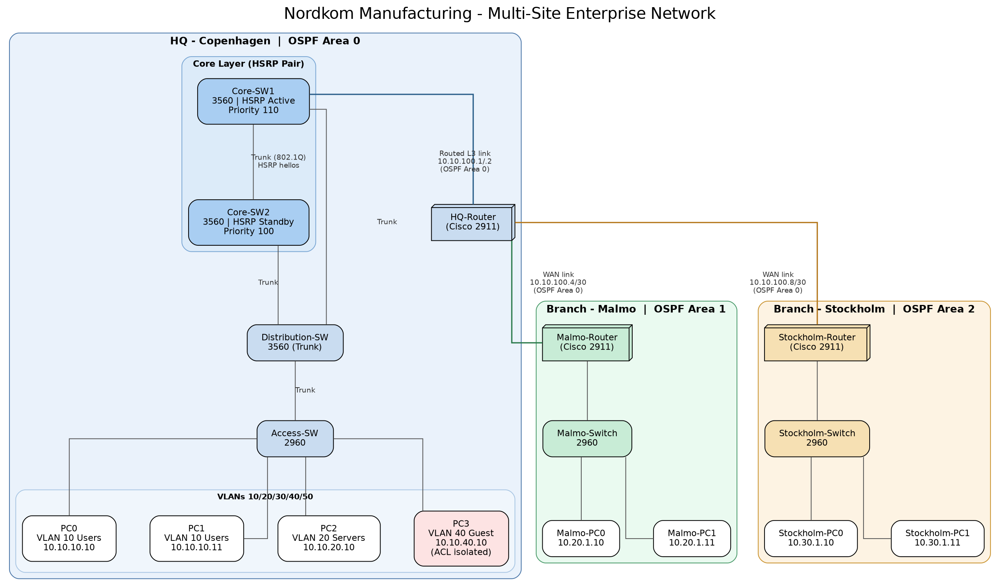

# Nordkom Manufacturing — Enterprise Network Architecture

A fully designed, built, and tested multi-site enterprise network architecture, structured and documented the way an architecture engagement would be — requirements, high-level and low-level design, architecture decision records, implementation, testing evidence, and operational documentation.

## Purpose

This repository demonstrates end-to-end network architecture practice: capturing requirements, translating them into a layered design, documenting and justifying every major decision, implementing the design in a lab environment, and proving it works through structured testing — not just producing a working configuration.

## How this repository is organized

| Folder | Contents |
|---|---|
| [`01-requirements/`](01-requirements) | Business and technical requirements that drove the design, and the assumptions made |
| [`02-architecture/`](02-architecture) | High-level design (HLD), low-level design (LLD), architecture decision records, and diagrams |
| [`03-implementation/`](03-implementation) | The actual device configurations, organized by layer |
| [`04-testing/`](04-testing) | Test plan and evidence — proof the design works, including failure/recovery scenarios |
| [`05-operations/`](05-operations) | Runbooks and operational notes for maintaining the environment |
| [`packet-tracer/`](packet-tracer) | The Cisco Packet Tracer project file used to build and test this design |

## Quick summary

**Nordkom Manufacturing** — a fictional mid-size manufacturer — needed a resilient, segmented network connecting its Copenhagen HQ to branch offices in Malmo and Stockholm, with no single point of failure at the HQ core and isolated guest network access.

**Delivered:** a 3-tier HQ architecture with HSRP-redundant core switching, 5-VLAN segmentation, multi-area OSPF routing across all three sites, and ACL-enforced guest isolation — every element built and verified through direct testing, documented in [`04-testing/test-evidence.md`](04-testing/test-evidence.md).

## Start here

- New to this project? Read [`01-requirements/business-requirements.md`](01-requirements/business-requirements.md) first, then [`02-architecture/hld.md`](02-architecture/hld.md)
- Want the "why" behind design choices? See [`02-architecture/architecture-decisions.md`](02-architecture/architecture-decisions.md)
- Want proof it works? See [`04-testing/test-evidence.md`](04-testing/test-evidence.md)
